# WebRTC 스터디 코드 진행 순서

이 문서는 완성된 코드를 한 번에 설명하는 대신, 팀원들과 함께 WebRTC 프로젝트를 단계별로 만들어가며 스터디를 진행하기 위한 자료입니다.

목표는 WebRTC를 처음 보는 팀원도 아래 흐름을 이해하는 것입니다.

```text
getUserMedia
→ RTCPeerConnection
→ addTrack
→ createOffer
→ setLocalDescription
→ offer 전달
→ setRemoteDescription
→ createAnswer
→ answer 전달
→ ICE candidate 교환
→ 영상/음성 연결
```

## 0. WebRTC 개념 먼저 설명하기

코드를 작성하기 전에 팀원들에게 WebRTC가 어떤 방식으로 연결되는지 먼저 설명합니다.

핵심 문장:

> WebRTC는 브라우저끼리 영상, 음성, 데이터를 실시간으로 주고받게 해주는 기술입니다. 단, 처음부터 바로 연결되는 것이 아니라 signaling 서버를 통해 연결 정보를 먼저 교환한 뒤 P2P 연결을 시도합니다.

## 0-1. 일반 서버 통신과 WebRTC 통신 차이

일반적인 웹 서비스에서는 브라우저가 서버에 요청하고 서버가 응답합니다.

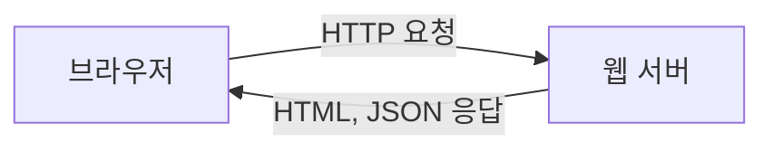

하지만 WebRTC에서는 연결이 완료된 뒤 영상과 음성 데이터가 브라우저끼리 직접 이동합니다.

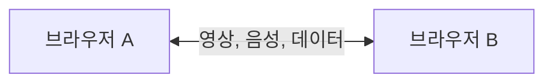

설명 포인트:

> 일반 웹 요청은 서버 중심입니다. WebRTC는 연결 준비에는 서버가 필요하지만, 연결이 성공하면 실제 영상과 음성은 브라우저끼리 직접 주고받습니다.

## 0-2. WebRTC에서 서버가 필요한 이유

브라우저 A와 브라우저 B는 처음에는 서로의 주소나 연결 정보를 모릅니다.

그래서 signaling 서버를 사용해 아래 정보를 교환합니다.

- offer
- answer
- ICE candidate

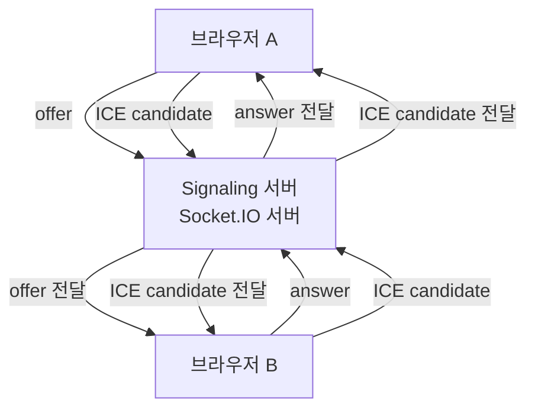

설명 포인트:

> signaling 서버는 영상과 음성을 전달하는 서버가 아닙니다. 브라우저끼리 연결을 시작할 수 있도록 연결 정보만 전달합니다.

## 0-3. 전체 연결 흐름 그림

WebRTC 연결은 크게 3단계로 볼 수 있습니다.

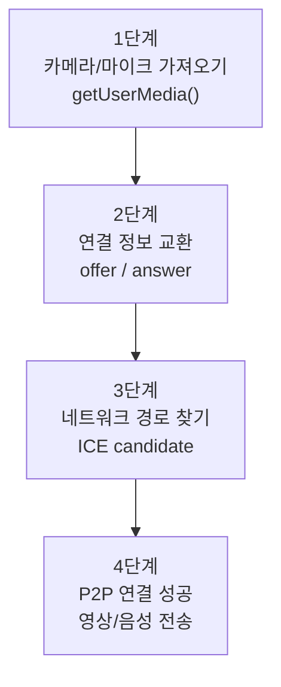

설명 포인트:

> WebRTC는 카메라를 가져온다고 바로 연결되는 것이 아닙니다. offer와 answer로 통신 조건을 합의하고, ICE candidate로 실제 연결 가능한 네트워크 경로를 찾은 뒤 연결됩니다.

## 0-4. Offer와 Answer 흐름

offer와 answer는 두 브라우저가 어떤 방식으로 통신할지 합의하는 과정입니다.

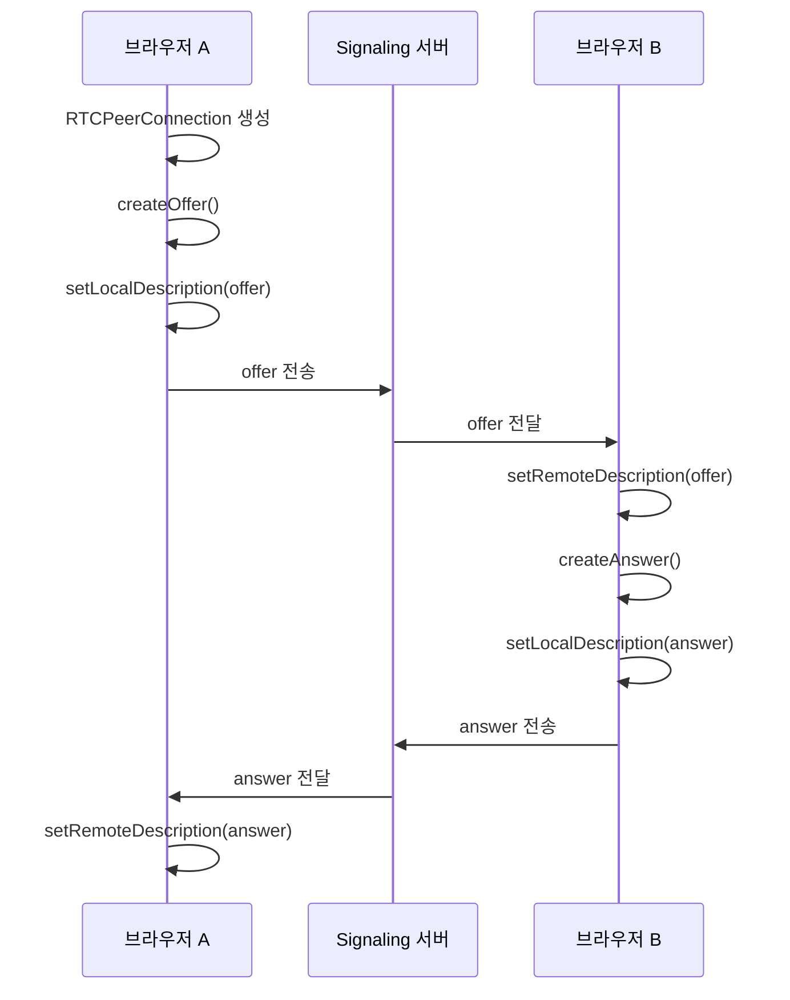

설명 포인트:

> offer는 "나는 이런 방식으로 통신할 수 있어"라는 제안입니다. answer는 "좋아, 나는 이렇게 받을 수 있어"라는 응답입니다.

## 0-5. ICE candidate와 P2P 연결

offer와 answer를 교환해도 아직 실제 네트워크 연결이 끝난 것은 아닙니다.

두 브라우저는 서로 연결 가능한 경로 후보를 찾아야 합니다. 이 후보를 ICE candidate라고 합니다.

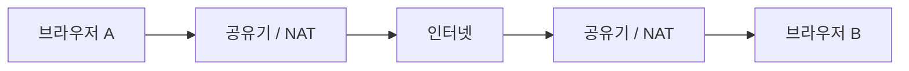

브라우저는 여러 연결 후보를 찾아 상대방과 교환합니다.

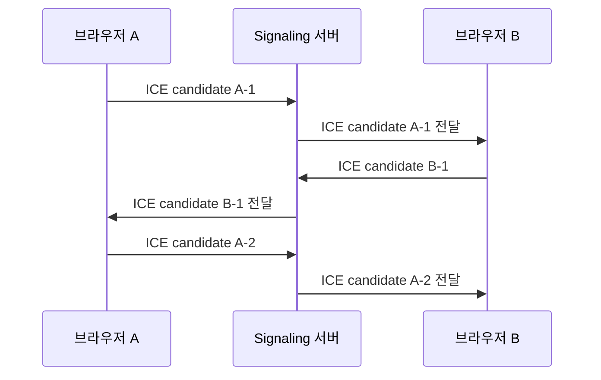

설명 포인트:

> ICE candidate는 "이 경로로 나에게 연결해볼 수 있어"라는 네트워크 후보입니다. 후보는 하나만 생기는 것이 아니라 여러 개 생길 수 있습니다.

## 0-6. STUN과 TURN이 필요한 이유

브라우저는 보통 공유기 뒤에 있습니다. 그래서 자기 자신이 외부에서 어떤 IP와 포트로 보이는지 모를 수 있습니다.

이때 STUN 서버가 도움을 줍니다.

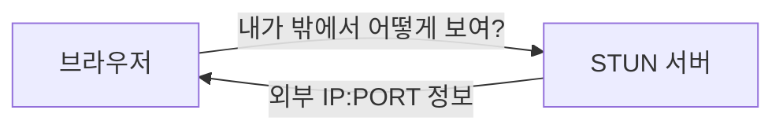

하지만 회사, 학교, 공공 와이파이처럼 직접 연결이 막힌 환경도 있습니다.

그럴 때는 TURN 서버가 중간에서 미디어를 대신 전달합니다.

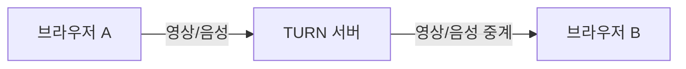

정리:

```text
STUN: 직접 연결할 수 있도록 외부 주소를 찾는 데 도움을 준다.
TURN: 직접 연결이 안 될 때 중간에서 데이터를 중계한다.
```

설명 포인트:

> 같은 와이파이나 단순한 네트워크에서는 STUN만으로 연결될 수 있습니다. 하지만 외부 네트워크나 방화벽이 강한 환경에서는 TURN 서버가 필요할 수 있습니다.

## 0-7. 연결 전과 연결 후의 데이터 흐름

연결 전에는 signaling 서버를 통해 연결 정보가 오갑니다.

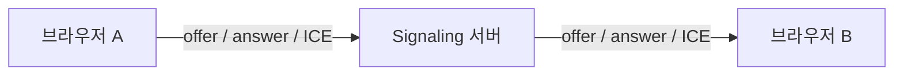

연결 후에는 영상과 음성이 브라우저끼리 직접 이동합니다.

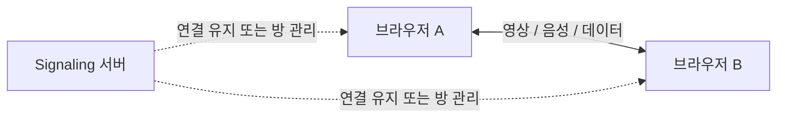

설명 포인트:

> WebRTC를 설명할 때 가장 중요한 구분은 "연결 정보는 서버를 거치고, 실제 미디어는 PeerConnection을 통해 이동한다"는 점입니다.

## 0-8. 발표나 스터디에서 사용할 쉬운 비유

처음 설명할 때는 아래 비유를 사용하면 이해가 쉽습니다.

```text
Signaling 서버 = 서로 연락처를 교환해주는 중간 관리자
Offer = 내가 통화할 수 있는 조건을 적은 초대장
Answer = 초대장에 대한 수락 응답
ICE candidate = 실제로 만날 수 있는 길 후보
STUN = 내 외부 주소를 알려주는 안내소
TURN = 길이 막혔을 때 대신 전달해주는 중계소
RTCPeerConnection = 실제 통화 연결을 관리하는 객체
```

짧은 설명 예시:

> 먼저 signaling 서버를 통해 서로의 연결 정보를 교환합니다. 이후 ICE candidate를 주고받으며 실제 연결 가능한 경로를 찾습니다. 연결이 성공하면 영상과 음성은 서버가 아니라 브라우저끼리 직접 주고받습니다.

## 1. 프로젝트 구조 만들기

먼저 아래와 같은 파일 구조를 만듭니다.

```text
webrtc-study-room/
├─ package.json
├─ server.js
└─ public/
   ├─ index.html
   ├─ style.css
   └─ client.js
```

각 파일의 역할:

- `server.js`: WebRTC 연결 정보를 전달하는 signaling 서버
- `index.html`: 방 입장, 영상 화면, 버튼 영역
- `style.css`: 화면 스타일
- `client.js`: WebRTC 핵심 로직
- `package.json`: 실행 스크립트와 의존성 관리

이 단계에서 설명할 핵심:

> WebRTC 서버는 영상과 음성을 직접 중계하는 서버가 아니라, 브라우저끼리 연결되도록 offer, answer, ICE candidate를 전달하는 signaling 서버입니다.

## 2. 서버부터 만들기

먼저 `server.js`를 작성합니다.

작성 순서:

1. Express 서버 만들기
2. Socket.IO 연결하기
3. `join-room` 이벤트 만들기
4. `offer` 전달 만들기
5. `answer` 전달 만들기
6. `ice-candidate` 전달 만들기
7. `leave-room`, `disconnect` 처리하기

설명 포인트:

> 서버는 offer, answer, ICE candidate를 해석하지 않습니다. 같은 방에 있는 상대방에게 전달만 합니다.

서버에서 다루는 이벤트:

```text
join-room      방 입장
offer          연결 제안 전달
answer         연결 응답 전달
ice-candidate  네트워크 후보 전달
leave-room     방 나가기
disconnect     접속 종료
```

## 3. HTML 화면 만들기

다음으로 `public/index.html`을 작성합니다.

작성 순서:

1. 방 번호 입력 폼
2. 닉네임 입력
3. 내 영상 영역 `localVideo`
4. 상대방 영상 영역 `remoteVideo`
5. 마이크, 카메라, 화면 공유, 나가기 버튼
6. 연결 상태 표시 영역
7. 연결 로그 영역

이 단계에서는 아직 WebRTC가 동작하지 않아도 됩니다.

설명 포인트:

> 지금 만드는 HTML 요소들은 나중에 `client.js`에서 가져와서 조작합니다. 예를 들어 `localVideo`에는 내 카메라 화면을 넣고, `remoteVideo`에는 상대방 화면을 넣습니다.

## 4. CSS는 화면 확인용으로 빠르게 적용하기

`public/style.css`를 작성합니다.

진행 순서:

1. 전체 레이아웃
2. 왼쪽 사이드바
3. 오른쪽 영상 영역
4. 버튼 스타일
5. 모바일 반응형

CSS는 WebRTC의 핵심은 아니므로 깊게 설명하지 않아도 됩니다.

설명 포인트:

> CSS는 기능 구현보다 화면 확인을 쉽게 하기 위한 보조 역할입니다. WebRTC 핵심은 `client.js`에 있습니다.

## 5. 클라이언트 JS 기본 변수 잡기

`public/client.js`에서 DOM 요소와 상태 변수를 먼저 선언합니다.

중요한 상태 변수:

```js
let roomId = "";
let localStream = null;
let remoteStream = null;
let peerConnection = null;
```

설명 포인트:

> `localStream`은 내 카메라와 마이크입니다. `remoteStream`은 상대방 영상과 음성입니다. `peerConnection`은 브라우저끼리 WebRTC 연결을 만드는 핵심 객체입니다.

## 6. getUserMedia로 내 영상 띄우기

가장 먼저 구현할 WebRTC 기능은 내 카메라와 마이크를 가져오는 것입니다.

핵심 코드:

```js
localStream = await navigator.mediaDevices.getUserMedia({
  video: true,
  audio: true
});

localVideo.srcObject = localStream;
```

완료 기준:

- 브라우저에서 카메라/마이크 권한 요청이 뜬다.
- 내 화면이 `localVideo`에 보인다.

설명 포인트:

> `getUserMedia()`는 브라우저에게 카메라와 마이크 사용 권한을 요청합니다. 사용자가 허용하면 `MediaStream`을 받을 수 있습니다.

## 7. 방 입장 구현하기

그다음 Socket.IO로 방 입장을 구현합니다.

클라이언트:

```js
socket.emit("join-room", {
  roomId,
  nickname
});
```

서버:

```js
socket.on("join-room", ({ roomId, nickname }) => {
  socket.join(roomId);
});
```

완료 기준:

- 사용자가 방 번호를 입력하고 입장할 수 있다.
- 서버 콘솔에서 누가 어떤 방에 들어왔는지 확인할 수 있다.

설명 포인트:

> 방 번호를 사용하는 이유는 같은 방에 있는 사용자끼리만 offer, answer, ICE candidate를 주고받게 하기 위해서입니다.

## 8. RTCPeerConnection 만들기

이제 WebRTC의 핵심 객체인 `RTCPeerConnection`을 만듭니다.

핵심 코드:

```js
const peerConnection = new RTCPeerConnection({
  iceServers: [
    { urls: "stun:stun.l.google.com:19302" }
  ]
});
```

설명 포인트:

> `RTCPeerConnection`은 브라우저와 브라우저 사이의 실시간 연결을 관리하는 객체입니다.

## 9. 내 미디어 트랙 추가하기

내 카메라와 마이크 트랙을 PeerConnection에 추가합니다.

핵심 코드:

```js
localStream.getTracks().forEach((track) => {
  peerConnection.addTrack(track, localStream);
});
```

설명 포인트:

> `addTrack()`을 해야 내 카메라와 마이크가 WebRTC 연결에 포함됩니다. 이 과정을 빼면 연결이 되더라도 영상과 음성이 상대방에게 가지 않습니다.

## 10. 상대방 영상 받기

상대방이 보낸 영상이나 음성 트랙이 도착하면 `ontrack` 이벤트가 실행됩니다.

핵심 코드:

```js
peerConnection.ontrack = (event) => {
  remoteVideo.srcObject = event.streams[0];
};
```

설명 포인트:

> `ontrack`은 상대방의 미디어가 도착했을 때 실행됩니다. 여기서 받은 스트림을 `remoteVideo`에 넣으면 상대방 화면이 보입니다.

## 11. Offer 만들기

같은 방에 상대방이 들어오면 기존 사용자가 offer를 만듭니다.

핵심 코드:

```js
const offer = await peerConnection.createOffer();
await peerConnection.setLocalDescription(offer);

socket.emit("offer", {
  roomId,
  offer
});
```

설명 포인트:

> offer는 "나는 이런 방식으로 영상과 음성을 보낼 수 있어"라는 연결 제안서입니다.

중요한 순서:

```text
createOffer()
→ setLocalDescription(offer)
→ socket.emit("offer")
```

## 12. Answer 만들기

offer를 받은 사용자는 answer를 만듭니다.

핵심 코드:

```js
await peerConnection.setRemoteDescription(offer);

const answer = await peerConnection.createAnswer();
await peerConnection.setLocalDescription(answer);

socket.emit("answer", {
  roomId,
  answer
});
```

설명 포인트:

> answer는 offer에 대한 응답입니다. 두 브라우저는 offer와 answer를 통해 어떤 방식으로 통신할지 합의합니다.

중요한 순서:

```text
setRemoteDescription(offer)
→ createAnswer()
→ setLocalDescription(answer)
→ socket.emit("answer")
```

## 13. Answer 적용하기

처음 offer를 만든 사용자는 상대방의 answer를 받아 적용합니다.

핵심 코드:

```js
await peerConnection.setRemoteDescription(answer);
```

설명 포인트:

> offer를 만든 쪽은 answer를 remote description으로 설정해야 연결 조건 합의가 완료됩니다.

## 14. ICE candidate 처리하기

offer와 answer만으로는 연결이 끝나지 않습니다. 실제 네트워크 경로 후보인 ICE candidate도 교환해야 합니다.

보내는 코드:

```js
peerConnection.onicecandidate = (event) => {
  if (event.candidate) {
    socket.emit("ice-candidate", {
      roomId,
      candidate: event.candidate
    });
  }
};
```

받는 코드:

```js
await peerConnection.addIceCandidate(candidate);
```

설명 포인트:

> ICE candidate는 두 브라우저가 실제로 연결할 수 있는 네트워크 경로 후보입니다. 후보가 여러 개 생길 수 있어서 여러 번 주고받습니다.

## 15. 연결 상태 로그 보여주기

디버깅과 발표를 위해 연결 상태를 화면에 보여줍니다.

핵심 코드:

```js
peerConnection.onconnectionstatechange = () => {
  connectionLabel.textContent = peerConnection.connectionState;
};
```

자주 볼 수 있는 상태:

```text
new
connecting
connected
disconnected
failed
closed
```

설명 포인트:

> 연결 상태를 화면에 보여주면 WebRTC가 어떤 단계에 있는지 팀원들이 직접 확인할 수 있습니다.

## 16. 마이크와 카메라 버튼 만들기

WebRTC 연결이 된 뒤 통화 제어 기능을 붙입니다.

마이크 on/off:

```js
localStream.getAudioTracks().forEach((track) => {
  track.enabled = isMicOn;
});
```

카메라 on/off:

```js
localStream.getVideoTracks().forEach((track) => {
  track.enabled = isCameraOn;
});
```

설명 포인트:

> 트랙의 `enabled` 값을 바꾸면 트랙을 제거하지 않고도 마이크나 카메라를 끄고 켤 수 있습니다.

## 17. 화면 공유 만들기

화면 공유는 마지막에 구현하는 것이 좋습니다.

핵심 코드:

```js
const screenStream = await navigator.mediaDevices.getDisplayMedia({
  video: true
});

const screenTrack = screenStream.getVideoTracks()[0];

await videoSender.replaceTrack(screenTrack);
```

설명 포인트:

> 화면 공유는 WebRTC 연결을 새로 만드는 것이 아닙니다. 기존에 보내던 카메라 비디오 트랙을 화면 공유 트랙으로 교체하는 방식입니다.

화면 공유 종료 시:

```js
screenTrack.onended = async () => {
  await videoSender.replaceTrack(cameraTrack);
  localVideo.srcObject = localStream;
};
```

설명 포인트:

> 사용자가 브라우저의 화면 공유 중지 버튼을 누르면 `screenTrack.onended`가 실행됩니다. 이때 다시 카메라 트랙으로 되돌립니다.

## 18. 나가기와 정리 처리

방에서 나갈 때는 연결과 미디어 트랙을 정리해야 합니다.

핵심 코드:

```js
peerConnection.close();

localStream.getTracks().forEach((track) => {
  track.stop();
});
```

설명 포인트:

> `close()`는 WebRTC 연결을 닫고, `track.stop()`은 카메라와 마이크 사용을 중지합니다.

## 19. 추천 스터디 시간표

### 1회차: 개념 + 서버 + HTML

진행 내용:

- WebRTC와 signaling 개념 설명
- 프로젝트 구조 만들기
- `server.js` 기본 작성
- `index.html` 화면 작성

목표:

- 서버와 화면의 역할을 이해한다.
- signaling 서버가 영상 중계 서버가 아니라는 점을 이해한다.

### 2회차: getUserMedia + 방 입장 + PeerConnection

진행 내용:

- 카메라/마이크 권한 요청
- 내 영상 표시
- 방 입장 이벤트 구현
- RTCPeerConnection 생성
- addTrack 구현

목표:

- 내 미디어를 가져와 WebRTC 연결 객체에 추가할 수 있다.

### 3회차: offer / answer / ICE candidate

진행 내용:

- offer 생성 및 전달
- answer 생성 및 전달
- remote/local description 설정
- ICE candidate 교환
- 상대방 영상 출력

목표:

- WebRTC 연결의 핵심 흐름을 이해하고 직접 구현한다.

### 4회차: 버튼 기능 + 화면 공유 + 발표 정리

진행 내용:

- 마이크 on/off
- 카메라 on/off
- 화면 공유
- 나가기 처리
- 발표 자료 정리

목표:

- 사용자 기능을 완성하고 발표 시연 흐름을 정리한다.

## 20. 서버와 클라이언트를 번갈아 작성하는 순서

WebRTC 프로젝트는 서버 파일을 전부 만든 뒤 클라이언트를 전부 만드는 방식보다, **이벤트 단위로 서버와 클라이언트를 왔다갔다 작성하는 방식**이 이해하기 쉽습니다.

추천 순서:

```text
1. 서버 기본 실행
2. 클라이언트 화면 연결
3. 방 입장 이벤트
4. 내 카메라/마이크 가져오기
5. peer-joined 이벤트
6. offer 이벤트
7. answer 이벤트
8. ICE candidate 이벤트
9. 나가기 이벤트
10. 통화 제어 버튼
```

### 20-1. 서버 기본 실행 먼저 만들기

먼저 `server.js`에서 Express, HTTP server, Socket.IO를 연결합니다.

서버:

```js
const app = express();
const server = http.createServer(app);
const io = new Server(server);

app.use(express.static("public"));
```

그 다음 브라우저에서 `public/index.html`이 열리는지 확인합니다.

목표:

```text
서버가 켜진다.
브라우저에서 화면이 보인다.
```

### 20-2. 클라이언트에서 Socket.IO 연결 확인

클라이언트:

```js
const socket = io();

socket.on("connect", () => {
  addLog(`시그널링 서버에 연결되었습니다. socket id: ${socket.id}`);
});
```

서버:

```js
io.on("connection", (socket) => {
  console.log(`[connection] socket=${socket.id}`);
});
```

이 단계는 서버와 클라이언트가 실시간으로 연결되는지 확인하는 단계입니다.

목표:

```text
브라우저 로그에 socket id가 보인다.
서버 콘솔에도 socket id가 보인다.
```

### 20-3. 방 입장 이벤트를 서버와 클라이언트에 같이 만들기

클라이언트에서 먼저 방 입장 요청을 보냅니다.

클라이언트:

```js
socket.emit("join-room", {
  roomId,
  nickname
});
```

그 다음 서버에서 이 이벤트를 받습니다.

서버:

```js
socket.on("join-room", ({ roomId, nickname }) => {
  socket.join(roomId);
});
```

그리고 서버가 입장 완료 응답을 보냅니다.

서버:

```js
socket.emit("room-joined", {
  roomId,
  peerId: socket.id,
  memberCount: members.size
});
```

클라이언트에서 응답을 받습니다.

클라이언트:

```js
socket.on("room-joined", ({ memberCount }) => {
  addLog(`방 입장 완료. 현재 인원: ${memberCount}`);
});
```

작성 흐름:

```text
클라이언트 emit("join-room")
→ 서버 on("join-room")
→ 서버 emit("room-joined")
→ 클라이언트 on("room-joined")
```

### 20-4. 카메라/마이크는 클라이언트에서 먼저 완성하기

방 입장 전후로 `getUserMedia()`를 구현합니다.

클라이언트:

```js
localStream = await navigator.mediaDevices.getUserMedia({
  video: true,
  audio: true
});

localVideo.srcObject = localStream;
```

이 단계는 서버와 직접 관련이 없습니다.

목표:

```text
내 브라우저에 내 카메라 화면이 보인다.
```

### 20-5. 상대방 입장 알림 만들기

두 번째 사용자가 같은 방에 들어오면, 서버가 기존 사용자에게 알려줍니다.

서버:

```js
socket.to(roomId).emit("peer-joined", {
  peerId: socket.id,
  nickname: socket.data.nickname
});
```

클라이언트:

```js
socket.on("peer-joined", async () => {
  await createAndSendOffer();
});
```

작성 흐름:

```text
새 사용자 join-room
→ 서버가 기존 사용자에게 peer-joined 전송
→ 기존 사용자가 offer 생성 시작
```

### 20-6. Offer 이벤트는 클라이언트와 서버를 한 쌍으로 작성하기

기존 사용자가 offer를 만듭니다.

클라이언트:

```js
const offer = await peerConnection.createOffer();
await peerConnection.setLocalDescription(offer);

socket.emit("offer", {
  roomId,
  offer
});
```

서버는 offer를 같은 방의 상대방에게 전달합니다.

서버:

```js
socket.on("offer", ({ roomId, offer }) => {
  socket.to(roomId).emit("offer", {
    peerId: socket.id,
    offer
  });
});
```

상대방 클라이언트는 offer를 받습니다.

클라이언트:

```js
socket.on("offer", async ({ offer }) => {
  await handleOffer(offer);
});
```

작성 흐름:

```text
클라이언트 A createOffer()
→ 클라이언트 A emit("offer")
→ 서버 on("offer")
→ 서버 emit("offer")
→ 클라이언트 B on("offer")
```

### 20-7. Answer 이벤트도 같은 방식으로 작성하기

offer를 받은 쪽이 answer를 만듭니다.

클라이언트:

```js
await peerConnection.setRemoteDescription(offer);

const answer = await peerConnection.createAnswer();
await peerConnection.setLocalDescription(answer);

socket.emit("answer", {
  roomId,
  answer
});
```

서버:

```js
socket.on("answer", ({ roomId, answer }) => {
  socket.to(roomId).emit("answer", {
    peerId: socket.id,
    answer
  });
});
```

처음 offer를 만든 클라이언트:

```js
socket.on("answer", async ({ answer }) => {
  await handleAnswer(answer);
});
```

작성 흐름:

```text
클라이언트 B createAnswer()
→ 클라이언트 B emit("answer")
→ 서버 on("answer")
→ 서버 emit("answer")
→ 클라이언트 A on("answer")
```

### 20-8. ICE Candidate 이벤트 작성하기

ICE candidate는 양쪽에서 여러 번 생길 수 있습니다.

클라이언트:

```js
peerConnection.onicecandidate = (event) => {
  if (event.candidate) {
    socket.emit("ice-candidate", {
      roomId,
      candidate: event.candidate
    });
  }
};
```

서버:

```js
socket.on("ice-candidate", ({ roomId, candidate }) => {
  socket.to(roomId).emit("ice-candidate", {
    peerId: socket.id,
    candidate
  });
});
```

상대방 클라이언트:

```js
socket.on("ice-candidate", async ({ candidate }) => {
  await handleIceCandidate(candidate);
});
```

작성 흐름:

```text
클라이언트 A/B onicecandidate
→ emit("ice-candidate")
→ 서버 on("ice-candidate")
→ 서버 emit("ice-candidate")
→ 상대 클라이언트 addIceCandidate()
```

### 20-9. 나가기 이벤트 작성하기

클라이언트:

```js
socket.emit("leave-room");
resetCall();
```

서버:

```js
socket.on("leave-room", () => {
  leaveAllRooms(socket);
});
```

상대방 클라이언트:

```js
socket.on("peer-left", () => {
  remoteVideo.srcObject = null;
});
```

작성 흐름:

```text
클라이언트 emit("leave-room")
→ 서버 on("leave-room")
→ 서버 emit("peer-left")
→ 상대 클라이언트 on("peer-left")
```

## 21. 스터디 진행 팁

- 처음부터 전체 코드를 보여주지 않는다.
- 한 단계 구현할 때마다 브라우저에서 바로 확인한다.
- 서버 콘솔과 브라우저 로그를 같이 본다.
- offer, answer, ICE candidate는 실제 로그를 찍어보며 설명한다.
- 오류가 나면 연결 순서를 먼저 확인한다.
- WebRTC가 어려운 이유는 코드 양보다 순서가 중요하기 때문이라고 설명한다.

## 22. 발표용 핵심 문장

팀원이 발표 때 사용할 수 있는 문장입니다.

> 저희 프로젝트는 WebRTC 기반 1:1 화상 스터디룸입니다.

> 서버는 영상과 음성을 직접 중계하지 않고, 브라우저끼리 연결될 수 있도록 offer, answer, ICE candidate를 전달하는 signaling 서버 역할을 합니다.

> 사용자가 같은 방에 입장하면 기존 사용자가 offer를 생성하고, 새 사용자가 answer를 생성합니다.

> 이후 양쪽 브라우저가 ICE candidate를 교환하면서 실제 연결 가능한 네트워크 경로를 찾습니다.

> 연결이 완료되면 영상과 음성은 WebRTC PeerConnection을 통해 브라우저끼리 직접 주고받습니다.
